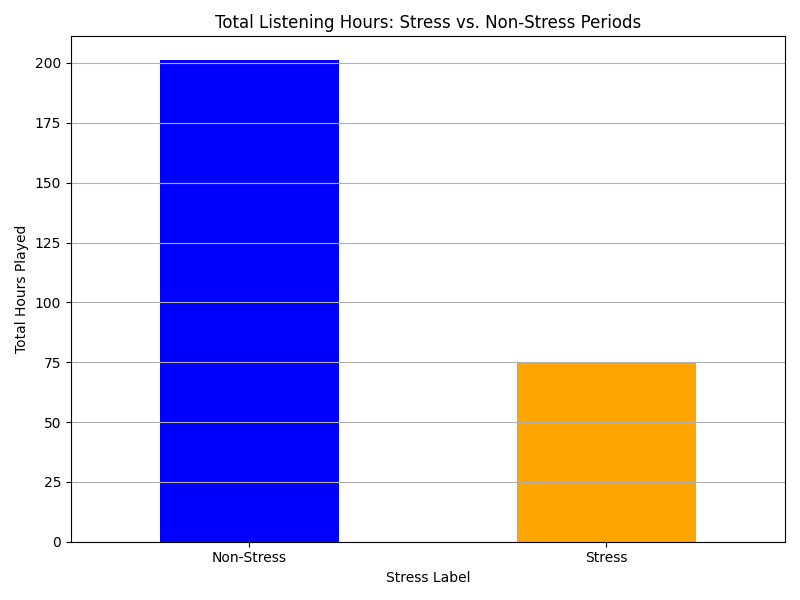
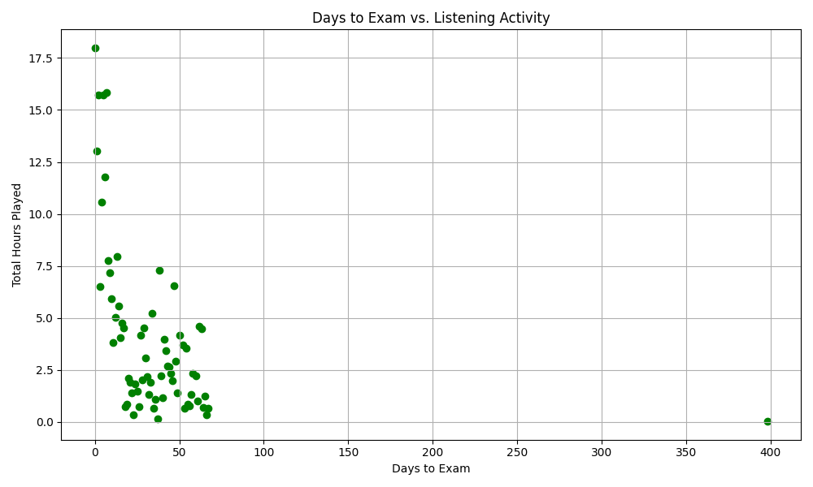
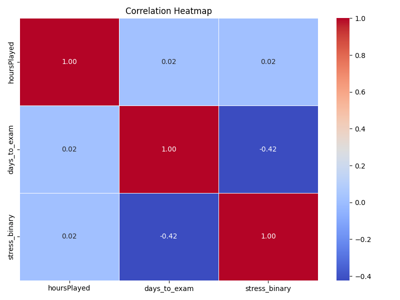

# Spotify Exam Analysis

**Sabanci University DSA210 Introduction to Data Science Course Fall 2024-2025**\
**Author:** Petek Metin

This project explores the relationship between my Spotify listening habits and exam dates to analyze how music preferences might correlate with stress and study habits. Through data analysis and machine learning, I aimed to uncover patterns in my listening behavior during high-stress periods.

---

## Table of Contents

1. [Motivation](#motivation)
2. [Main Research Questions](#main-research-questions)
3. [Data](#data)
4. [Methodology](#methodology)
5. [Findings](#findings)
6. [Visualizations](#visualizations)
7. [Limitations](#limitations)
8. [Future Work](#future-work)
9. [How to Run](#how-to-run)

---

## Motivation

Stress during exams can influence behavior, including how we consume media like music. This project was inspired by a desire to understand if and how my music habits change during exam periods and whether these habits could reflect stress levels or study habits.

---

## Main Research Questions

1. How do my listening habits change in the days leading up to and following exams?
2. Can listening patterns predict stressful periods?

---

## Data

- **Spotify Listening Data**:
  - Exported from Spotify's data privacy portal.
  - Includes timestamps, track names, artists, and listening duration (milliseconds).
- **Exam Dates**:
  - Manually compiled based on my semester schedule.
  - Includes exam dates and times.

---

## Methodology

1. **Preprocessing**:
   - Combined and cleaned Spotify JSON files.
   - Added calculated features like:
     - `hoursPlayed`: Listening duration in hours.
     - `days_to_exam`: Days remaining to the nearest exam.
     - `stress_label`: Binary label (Stress vs. Non-Stress).
2. **Exploratory Data Analysis (EDA)**:
   - Created visualizations to explore listening patterns over time.
3. **Machine Learning**:
   - Trained a Random Forest classifier to predict stress periods based on listening habits.

---

## Findings

### Exploratory Data Analysis

1. **Listening Habits During Stress Periods**:

   - The total listening hours significantly decreased during stress periods compared to non-stress periods. As shown in the bar chart, non-stress periods had nearly double the listening time compared to stress periods.

2. **Proximity to Exams and Listening Activity**:

   - The scatter plot revealed that as the days to exams decreased, the total hours of listening sharply declined. This suggests a behavioral shift toward reduced leisure activity as exams approached.

3. **Correlation Analysis**:

   - A moderate negative correlation exists between `days_to_exam` and `stress levels`, indicating that the closer the exams, the higher the likelihood of reduced listening. Interestingly, `hoursPlayed` had minimal direct correlation with stress, suggesting that other factors may also play a role in music consumption.

### Machine Learning

1. **Model Accuracy**:

   - The Random Forest classifier achieved a high accuracy of **93%** in predicting stress periods based on listening behavior.

2. **Feature Importance**:

   - `days_to_exam` was the most significant predictor, contributing **82.7%** to the model’s decisions.
   - `hoursPlayed` accounted for **17.3%** of the predictive power.

3. **Conclusion**:

   - Proximity to exams is a reliable indicator of stress periods, validated both through statistical analysis and machine learning.

---

## Visualizations

### 1. Total Listening Hours: Stress vs. Non-Stress Periods



**Insight**: Listening hours decrease during stress periods compared to non-stress periods. The bar chart shows a significant reduction in listening activity during stress periods.

---

### 2. Days to Exam vs. Listening Activity



**Insight**: Listening activity declines as exams approach. The scatter plot indicates a clear reduction in total hours played as the days to the nearest exam decrease.

---

### 3. Correlation Heatmap



**Insight**: A moderate negative correlation exists between `days_to_exam` and stress levels. While `hoursPlayed` shows minimal direct correlation with stress, the heatmap highlights `days_to_exam` as the key factor.

---

## Limitations

- **Data Coverage**:
  - Limited to one semester; findings may not generalize.
- **Metadata**:
  - Lack of detailed genre or mood information from Spotify JSON data.
- **Sample Size**:
  - Results are highly personalized and may not apply universally.

---

## Future Work

1. Collect data across multiple semesters to observe trends over time.
2. Use Spotify API to enhance the dataset with genre and mood information.
3. Explore additional features like time of day and day of the week.
4. Experiment with other machine learning models for improved accuracy.

---

## How to Run

### **Preprocessing**

1. Ensure you have the necessary dependencies installed:
   ```bash
   pip install pandas matplotlib seaborn scikit-learn
   ```
2. Run the preprocessing script to generate processed data and visualizations:
   ```bash
   python3 src/spotify_preprocess.py
   ```

### **Machine Learning**

1. Run the machine learning script to train the model and evaluate results:
   ```bash
   python3 src/spotify_ml.py
   ```

---

This project demonstrates how personal data can reveal insights into behavior and stress patterns. If you have any questions or suggestions, feel free to reach out!


